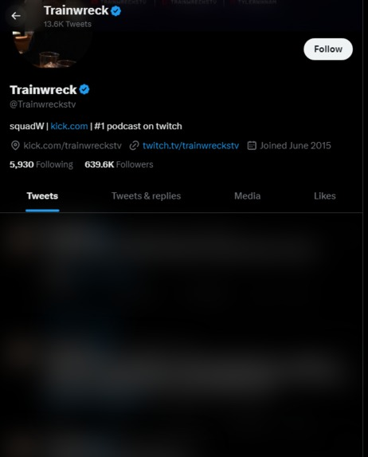

# Twitter Filter

  

Twitter Filter Chrome Extension is a project that allows users to filter toxic text content on the Twitter website using the Cohere AI API for text classification. The extension injects a content script into the active tab on Twitter, which monitors tweets and applies a blur effect to those that are classified as toxic.

## Features

- Automatic text classification of tweets using the Cohere AI API.
- Blur effect applied to toxic tweets to filter them from view.
- Toggle the filtering behavior using a checkbox in the extension's popup UI.
- Chrome extension architecture for easy installation and usage.

## How It Works

1. The Chrome extension injects a content script into the active tab on the Twitter website.
2. The content script uses a MutationObserver to detect newly added tweets on the Twitter feed.
3. When a new tweet is detected, the text content of the tweet is extracted for classification.
4. The content script sends the extracted text to the Cohere AI API for text classification.
5. The API returns the classification result, indicating whether the tweet is toxic or not.
6. If the tweet is classified as toxic, the content script applies a blur effect to the tweet element to hide it from view.

## Installation

1. Clone this repository to your local machine.
2. Open Google Chrome and go to `chrome://extensions`.
3. Enable "Developer mode" in the top right corner.
4. Click on "Load unpacked" and select the folder where you cloned the repository.
5. The extension should now appear in your Chrome extensions list.

## Configuration

Before using the extension, make sure to set up your Cohere AI API credentials:

1. Sign up for an account at https://cohere.ai/ and obtain your API key.
2. Replace `'Bearer YOUR_API_KEY'` in the `classifyArr` function with your actual API key.

## Usage

1. Open Twitter in a new tab or navigate to an existing Twitter tab.
2. Click on the extension icon to open the popup UI.
3. Check the checkbox in the popup UI to enable the filtering of toxic tweets.
4. Uncheck the checkbox to disable the filtering and reveal all tweets.

## Contributing

Contributions are welcome! If you find any bugs or have suggestions for improvement, please open an issue or submit a pull request.

## Acknowledgments

- The Cohere AI API for text classification.
- [Google Chrome Extension Documentation](https://developer.chrome.com/docs/extensions/mv3/getstarted/).
